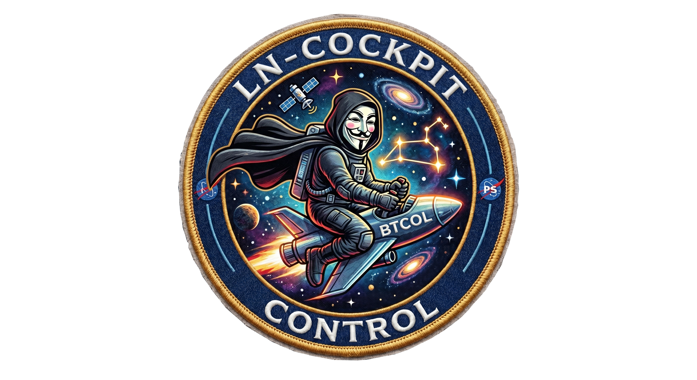
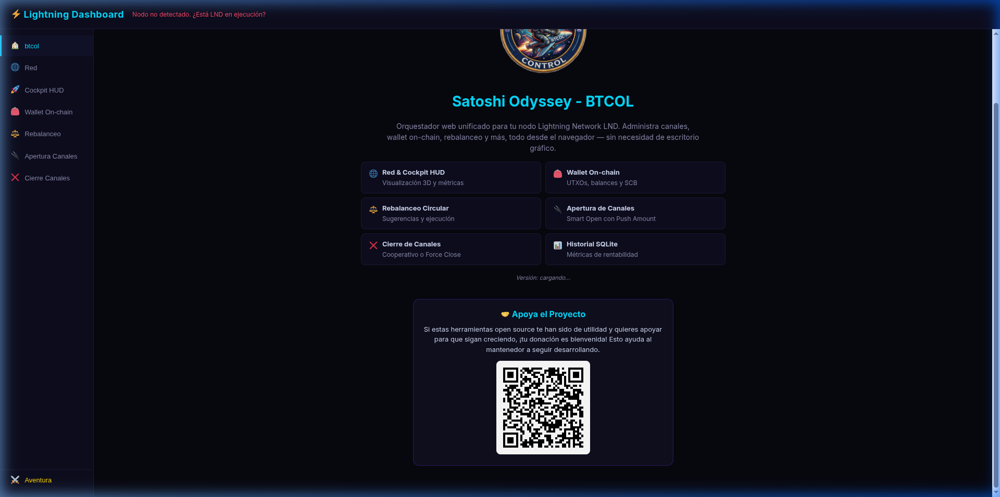
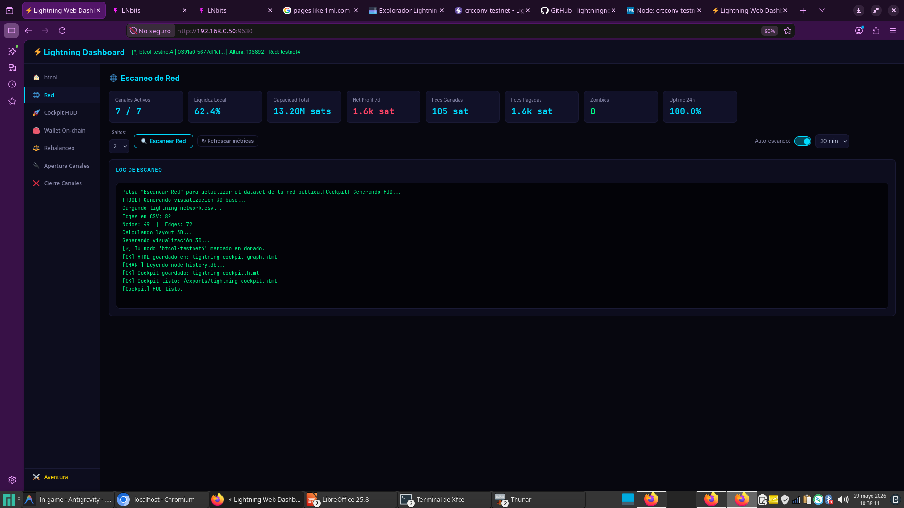
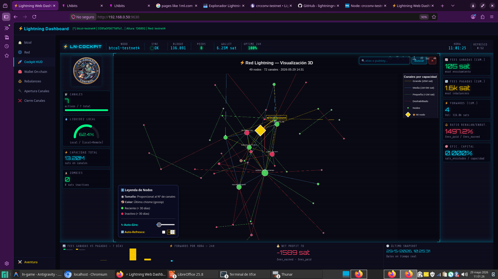
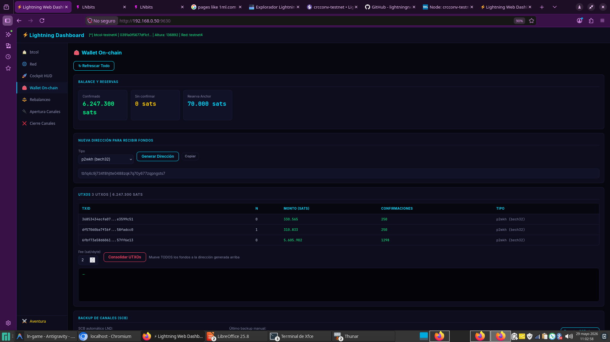
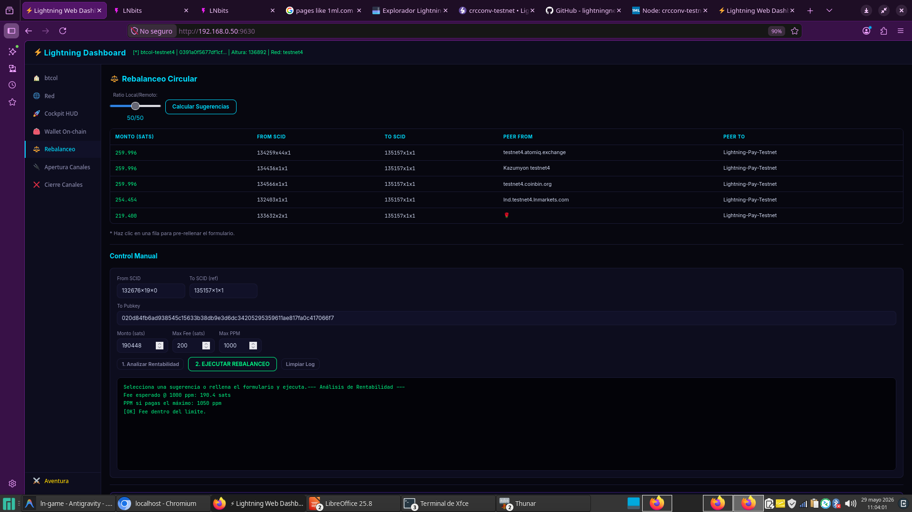
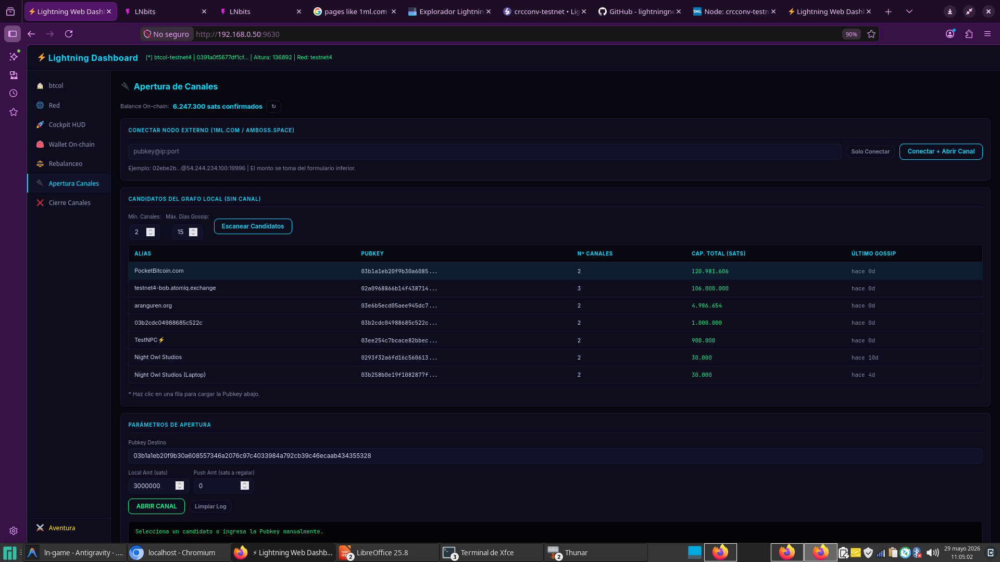
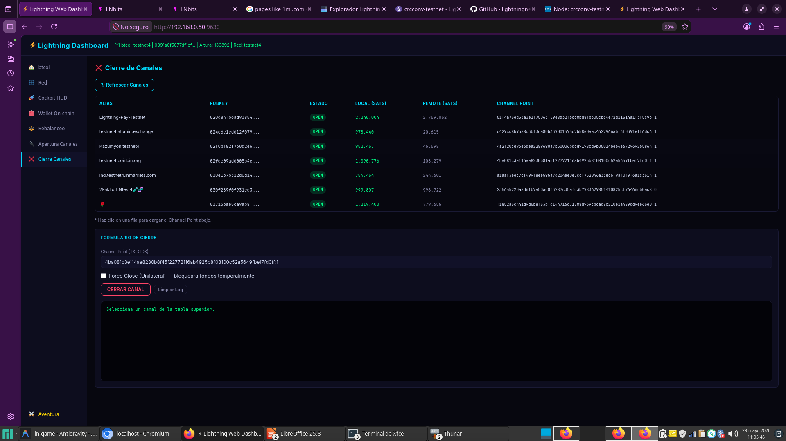
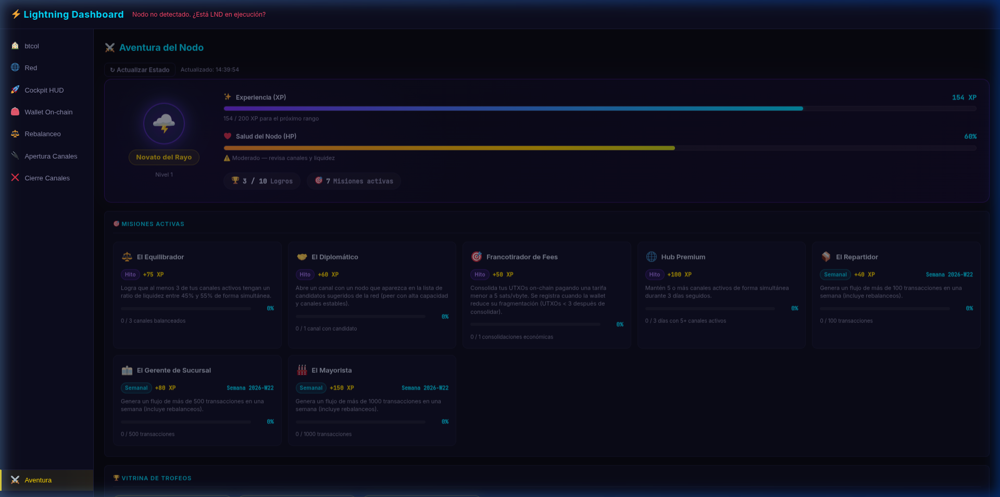

# ⚡ Satoshi Odyssey — El Videojuego de tu Nodo Lightning



> [!IMPORTANT]
> **🎮 BIENVENIDO A SATOSHI ODYSSEY:** Este proyecto es una herramienta avanzada de administración y monitoreo para nodos de la red Lightning basados en **LND (Lightning Network Daemon)**. Con fines **educativos** y para **mejorar significativamente la experiencia de usuario**, el sistema incorpora una innovadora capa de **gamificación y aventura interactiva (elementos RPG)**. Diseñado tanto para operadores experimentados como para estudiantes, corre bajo una arquitectura web unificada, ligera y **100% adaptable a teléfonos móviles, tablets y computadoras**.

---

## 🕹️ Las 8 Secciones del Cockpit (Tablero de Control)

El panel interactivo de **Satoshi Odyssey** está dividido en 8 pestañas tácticas. A continuación, se detalla el propósito de cada una de ellas junto con su respectiva visualización real:

### 1. 🏠 BTCOL Home
Es el centro de bienvenida y la puerta de entrada al cockpit. Muestra el estado general del sistema, los créditos del proyecto de código abierto y un resumen rápido de las utilidades disponibles.



---

### 2. 🌐 Red (Consultas & Vecinos LND)
Esta pestaña está dedicada a la monitorización y consulta activa de las conexiones del nodo y su relación con la Lightning Network. A nivel de infraestructura, realiza tareas programadas y continuas de comunicación con tu nodo usando el binario de comandos `lncli`:
* **Consulta de Topología**: Realiza peticiones de red como `lncli describegraph` y `lncli getnetworkinfo` para estructurar la topología de la red Lightning.
* **Actualización de Vecinos**: Consulta periódicamente el estado de conexión directa con tus peers ejecutando `lncli listpeers` y `lncli listchannels`.
* **Carga de Métricas y Activación Periódica**: Automatiza la recolección de estadísticas e información de canales en segundo plano. Dado que el daemon del juego ejecuta estas consultas programadas, todos los detalles y flujos se imprimen directamente en la consola activa (logs en vivo), permitiéndote auditar el estado del nodo de forma rápida.



---

### 3. 🚀 Cockpit HUD (Grafo 3D Interactivo)
Es el centro táctico visual donde se trabaja y se explora la topología del nodo en tres dimensiones. Aquí es donde se renderiza y se opera el **Grafo 3D Interactivo de la red**, representando cada uno de tus canales activos como una viga de energía viva. Los colores indican dinámicamente su estado de salud:
* **Amarillo 🟡**: Canales premium de alta liquidez (+5M de sats).
* **Azul 🔵**: Canales balanceados y saludables (+1M de sats).
* **Rojo 🔴**: Canales caídos, zombies o de muy baja capacidad.



---

### 4. 💼 Wallet On-Chain
Administra el inventario de fondos crudos (UTXO) de tu nodo. Permite generar nuevas direcciones de depósito Bitcoin (con compatibilidad de fallback en HTTP local), consultar balances confirmados y pendientes, y vigilar la consolidación de tarifas.



---

### 5. ⚖️ Rebalanceo Circular
Optimiza la liquidez de tus canales moviendo fondos de manera circular. Cuenta con el **Analizador de Rentabilidad**, el cual calcula la viabilidad financiera estimando el costo en comisiones versus los límites definidos (en Sats y PPM) antes de ejecutar el rebalanceo automático.



---

### 6. 🔌 Apertura de Canales
Crea nuevos enlaces de energía. Cuenta con el sistema de **Apertura Inteligente** que incluye la opción **"Push Amount"** para inyectar saldo inicial en el extremo remoto del canal y lograr un balance simétrico inmediato desde su creación (Úselo con precaución).



---

### 7. ❌ Cierre de Canales
Permite desconectarte de peers inactivos de manera segura. Ofrece opciones de cierre cooperativo (Coop Close) o forzado (Force Close) y destaca los canales calificados como "zombies" (inactivos por más de 7 días sin actualizaciones de red).



---

### 8. 🛡️ Aventura (Misiones y Logros)
Es el núcleo del sistema de gamificación. Aquí el operador puede dar seguimiento a sus puntos de experiencia (XP), verificar la salud del nodo (HP), desbloquear medallas/trofeos en la vitrina e intentar superar las misiones semanales y de hitos históricos.



---

## 🏆 Reglas de Gamificación

La administración de tu nodo está regulada por mecánicas lógicas diseñadas bajo SQLite:

### 📈 Puntos de Experiencia (XP) y Rangos
Ganas XP al realizar enrutamientos exitosos, cobrar comisiones y desbloquear logros especiales. A medida que acumulas XP, tu rango evoluciona:
* **Nivel 0**: *Aprendiz de Satoshi* (0 XP)
* **Nivel 1**: *Novato del Rayo* (50 XP)
* **Nivel 2**: *Enrutador Activo* (200 XP)
* **Nivel 3**: *Maestro de Liquidez* (500 XP)
* **Nivel 4**: *Hub de la Red* (+1000 XP)

### 🏥 Salud del Nodo (HP)
Una barra de vida del 0% al 100% que penaliza malas prácticas de red:
* **Zombies (-10 HP c/u)**: Canales inactivos o caídos de larga duración.
* **Desbalances Severos (-20 HP)**: Canales con ratios de liquidez extremos (<20% o >80%).
* **Desconexiones (-5 HP c/u)**: Fallas de red en las últimas 24 horas.
* **Bonus de Uptime (+5 HP)**: Concedido si mantienes un 100% de uptime por más de 3 días.

### 📜 Desafíos Semanales y de Hitos (Quests)
* **"El Equilibrador"**: Lograr mantener 3 canales con un ratio simétrico (50/50).
* **"Cazador de Zombies"**: Detectar y liquidar un canal inactivo.
* **"El Repartidor"**: Alcanzar un flujo de 100 transacciones en una semana.

---

## 📋 Requisitos Previos (Fundamentales)

Para que el motor del juego pueda conectarse y funcionar, es imprescindible contar con la siguiente infraestructura operativa. Satoshi Odyssey es un tablero interactivo que administra tu infraestructura real, por lo que requiere:

1. **Bitcoin Core Activo**: Un nodo completo de Bitcoin configurado y sincronizado en red principal (`mainnet`) o alguna red de pruebas (como `testnet4` o `signet`).
2. **Nodo LND Operativo**: Un daemon de LND (`lnd`) correctamente configurado y vinculado a tu nodo de Bitcoin Core.
3. **Billetera Desbloqueada**: La cartera interna de LND debe estar inicializada y desbloqueada (mediante `lncli unlock` o desbloqueo automático) para que la herramienta pueda consultar estados y firmar operaciones.

---

## 🚀 Inicio Rápido

Para iniciar tu odisea en la red Testnet4 de Bitcoin, sigue estos simples pasos:

```bash
# 1. Acceder al directorio del proyecto
cd satoshi-odyssey

# 2. Instalar dependencias requeridas
pip install -r requirements.txt

# 3. Configurar tu archivo .env local (.env)
#    Copia el .env.example y ajusta tus credenciales y ruta de lncli:
#    WEB_USER=satoshi
#    WEB_PASS=lightning
#    LNCLI_BIN=lncli-debug

# 4. Arrancar el motor del juego
python3 app.py
# → Accede desde tu navegador en http://localhost:9630
```

---

## ⚙️ Variables de Entorno (.env)

El archivo `.env` permite configurar de manera flexible el comportamiento del motor de simulación:

| Variable | Default | Descripción |
|---|---|---|
| `WEB_USER` | `satoshi` | Usuario de acceso web |
| `WEB_PASS` | `lightning` | Contraseña de acceso web |
| `WEB_PORT` | `9630` | Puerto local del servidor |
| `WEB_HOST` | `0.0.0.0` | Dirección de escucha |
| `NETWORK` | `testnet4` | Red de pruebas LND |
| `LNCLI_BIN` | `lncli-debug` | Ejecutable del cliente lncli |
| `BITCOIN_CLI_BIN` | `bitcoin-cli-debug` | Ejecutable del cliente bitcoin-cli |
---

## 🛡️ Créditos y Apoyo

Este software es de código abierto. Si encuentras valor en su uso académico o práctico, ¡tu contribución es sumamente bienvenida!

* **Autor Original**: **[btcol](https://github.com/btcol)**
* **Donaciones Lightning**: Puedes apoyar directamente al creador del proyecto escaneando el siguiente código QR desde tu billetera compatible con Lightning Network:


